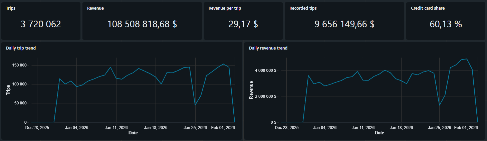
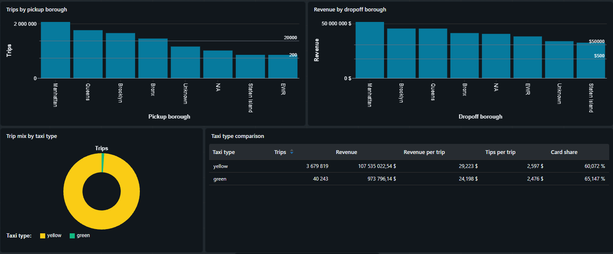
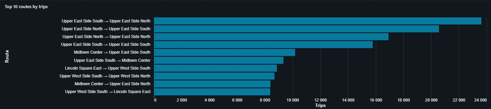
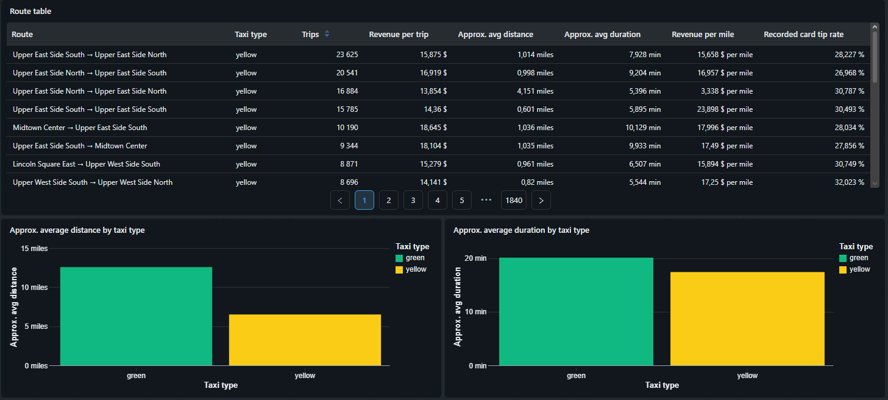
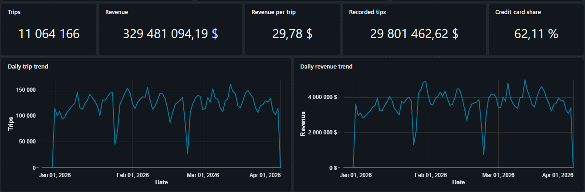
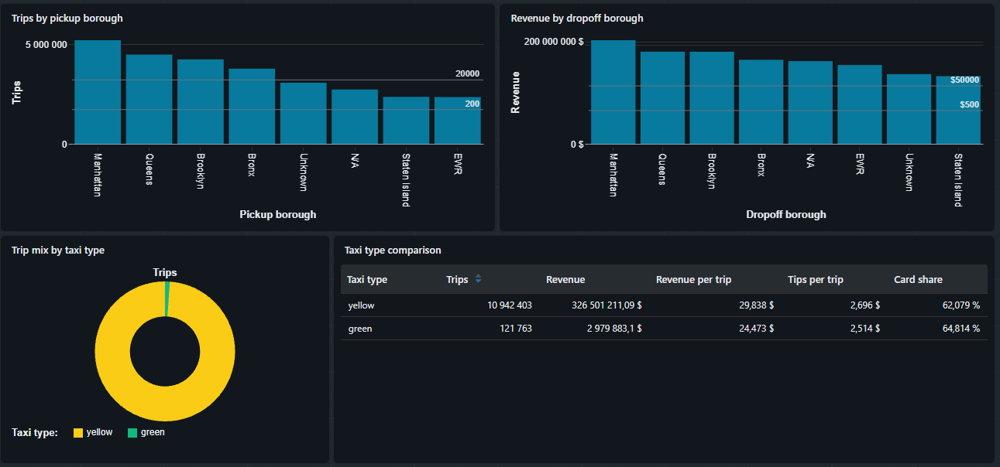
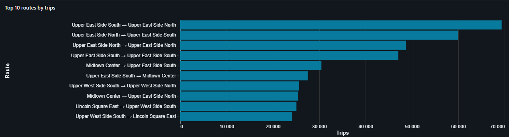
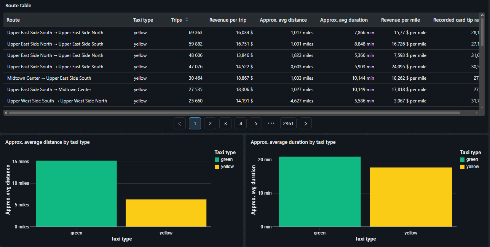

# NYC Taxi Trips — Azure Databricks Data Engineering Pipeline

End-to-end data engineering project for processing NYC Yellow and Green Taxi trip data using Azure Databricks, Apache Spark, Delta Lake, ADLS Gen2, Terraform, and Lakeflow Declarative Pipelines.

The project implements a **Medallion Architecture** with incremental ingestion, data-quality validation, PII encryption, analytical aggregations, and a Databricks Lakeview dashboard.

---

## Architecture

```text
NYC Taxi Trip Data
        │
        ▼
Azure Data Lake Storage Gen2
        │
        ▼
┌─────────────────────────────┐
│         Bronze              │
│                             │
│ Auto Loader                 │
│ Incremental ingestion       │
│ PII encryption              │
│ Raw Delta tables            │
└──────────────┬──────────────┘
               │
               ▼
┌─────────────────────────────┐
│          Silver             │
│                             │
│ Data validation             │
│ Quality expectations        │
│ Invalid-record filtering    │
└──────────────┬──────────────┘
               │
               ▼
┌─────────────────────────────┐
│           Gold              │
│                             │
│ Taxi type integration       │
│ Taxi zone enrichment        │
│ Route / revenue metrics     │
└──────────────┬──────────────┘
               │
               ▼
      Databricks Lakeview
            Dashboard
```

The Bronze, Silver, and Gold layers are orchestrated through a **Lakeflow Declarative Pipeline using serverless compute**.

Azure infrastructure is provisioned with **Terraform**, while the Databricks pipeline is configured and deployed using a **Databricks Asset Bundle**.

---

## Technology Stack

| Technology                     | Purpose                                  |
| ------------------------------ | ---------------------------------------- |
| Microsoft Azure                | Cloud platform                           |
| Azure Data Lake Storage Gen2   | Data lake storage                        |
| Azure Databricks               | Data engineering and analytics platform  |
| Apache Spark / PySpark         | Distributed data processing              |
| Spark Structured Streaming     | Incremental processing                   |
| Databricks Auto Loader         | Incremental file ingestion               |
| Delta Lake                     | Storage layer for pipeline tables        |
| Lakeflow Declarative Pipelines | Bronze → Silver → Gold orchestration     |
| Unity Catalog                  | Data and external-storage governance     |
| Databricks Asset Bundles       | Pipeline configuration and deployment    |
| Databricks Secrets             | Secure PII encryption-key storage        |
| Databricks Lakeview            | Dashboarding and analytics               |
| Terraform                      | Infrastructure as Code                   |
| Python                         | Processing utilities and data enrichment |
| SQL                            | Analytics and data exploration           |

---

# Data

The project uses:

* NYC Yellow Taxi trip records
* NYC Green Taxi trip records
* NYC Taxi Zone Lookup data

The trip datasets are stored as Parquet files, while the Taxi Zone Lookup dataset is stored as CSV.

For the incremental-ingestion demonstration, taxi data from **January, February, and March** is used.

The source storage structure is:

```text
data/
├── landing/
│   ├── yellow/
│   │   └── *.parquet
│   │
│   └── green/
│       └── *.parquet
│
└── reference/
    └── taxi_zone_lookup.csv
```

---

# Medallion Architecture

## Bronze Layer

The Bronze layer incrementally ingests Yellow and Green Taxi Parquet files from ADLS Gen2 using **Databricks Auto Loader**.

It performs:

* incremental file discovery;
* streaming ingestion;
* synthetic PII encryption;
* ingestion metadata generation;
* date partitioning;
* raw Delta-table creation;
* Taxi Zone reference-data ingestion.

The PII fields encrypted during Bronze ingestion are:

```text
customer_first_name
customer_last_name
customer_email
```

PII encryption is implemented in `pii_utils.py` and packaged as a Python wheel used by the Lakeflow pipeline.

Bronze tables include:

```text
bronze.yellow_trips_raw
bronze.green_trips_raw
bronze.taxi_zones_raw
```

---

## Silver Layer

The Silver layer reads the Bronze taxi tables and applies data-quality rules using **Lakeflow expectations**.

Validation covers conditions such as:

* required pickup and drop-off timestamps;
* drop-off time occurring after pickup time;
* valid pickup and drop-off location IDs;
* valid trip-distance values.

Records that violate the configured quality requirements are excluded from the cleaned datasets.

Silver tables:

```text
silver.yellow_trips
silver.green_trips
```

---

## Gold Layer

The Gold layer integrates Yellow and Green Taxi records into a common analytical model.

Both taxi types are normalized and written into the unified trip dataset:

```text
all_taxi_trips
```

The trips are then enriched using Taxi Zone reference data and aggregated into:

```text
daily_route_metrics
```

The analytical layer contains metrics including:

* trip count;
* total revenue;
* average trip amount;
* total tips;
* average trip distance;
* average trip duration;
* total trip distance;
* recorded tip rate;
* revenue per mile;
* credit-card usage;
* cash usage;
* pickup borough and zone;
* drop-off borough and zone.

These Gold datasets provide the source for the Databricks Lakeview dashboard.

---

# Incremental Processing

The project demonstrates incremental ingestion using two pipeline executions.

## Initial Load — January

Initially, only January Yellow and Green Taxi files are placed in the ADLS landing directories.

The first pipeline execution processes January data through:

```text
ADLS
  ↓
Bronze
  ↓
Silver
  ↓
Gold
```

**Recording:** [January initial ingestion](docs/records/january_10s.mp4)

---

## Incremental Load — February and March

February and March files are subsequently added to the same landing directories.

On the next pipeline execution, Auto Loader detects the newly arrived files and processes the additional data.

Previously discovered source files do not need to be ingested again.

```text
Existing January data
        +
New February / March files
        │
        ▼
   Auto Loader
        │
        ▼
Bronze → Silver → Gold
```

**Recording:** [February–March incremental ingestion](docs/records/feb_march_15s.mp4)

This demonstrates incremental file ingestion and propagation of new data through the complete Medallion pipeline.

---

# Dashboard

The Gold layer feeds the **NYC Taxi — Demand and Revenue** Databricks Lakeview dashboard.

The dashboard covers:

* total trips;
* revenue;
* Yellow vs Green Taxi demand;
* monthly trends;
* route performance;
* borough and zone analysis;
* payment behavior;
* trip-distance metrics;
* trip-duration metrics.

The exported Lakeview dashboard definition is stored in:

```text
dashboards/NYC Taxi — Demand and Revenue.lvdash.json
```

## January

### Overview





### Performance





---

## January–March

After February and March are incrementally ingested, the same dashboard reflects all three months of data.

### Overview





### Performance





---

# Infrastructure

Azure infrastructure is provisioned using Terraform.

Terraform creates the main infrastructure required by the project:

```text
Azure Resource Group
        │
        ├── ADLS Gen2 Storage Account
        │       │
        │       └── data filesystem
        │
        ├── Azure Databricks Workspace
        │
        └── Databricks Access Connector
                │
                └── Managed Identity
                        │
                        └── Storage Blob Data Contributor
                            on ADLS
```

The **Databricks Access Connector** provides the managed identity used by Unity Catalog to access the ADLS Gen2 storage account.

---

# Project Structure

```text
NYC_Taxi_trips/
│
├── dashboards/
│   └── NYC Taxi — Demand and Revenue.lvdash.json
│
├── docs/
│   ├── dashboard/
│   │   ├── overview_top_1.png
│   │   ├── overview_bottom_1.png
│   │   ├── performance_top_1.png
│   │   ├── performance_bottom_1.png
│   │   ├── overview_top_2.png
│   │   ├── overview_bottom_2.png
│   │   ├── performance_top_2.png
│   │   └── performance_bottom_2.png
│   │
│   └── records/
│       ├── january_10s.mp4
│       └── feb_march_15s.mp4
│
├── notebooks/
│   ├── 00_metadata.ipynb
│   ├── 01_bronze_layer.ipynb
│   ├── 02_silver_layer.ipynb
│   └── 03_gold_layer.ipynb
│
├── terraform/
│   ├── main.tf
│   ├── variables.tf
│   └── versions.tf
│
├── databricks.yml
├── enrich_trip_data.py
├── pii_utils.py
├── pyproject.toml
└── requirements.txt
```

## Main Components

### `00_metadata.ipynb`

Creates the required data schemas used by the Medallion Architecture.

### `01_bronze_layer.ipynb`

Implements:

* Auto Loader;
* streaming ingestion;
* PII encryption;
* partitioning;
* Bronze tables;
* Taxi Zone reference-data ingestion.

### `02_silver_layer.ipynb`

Implements:

* data-quality expectations;
* invalid-record filtering;
* cleaned Silver tables.

### `03_gold_layer.ipynb`

Implements:

* Yellow and Green Taxi integration;
* append flows;
* Taxi Zone enrichment;
* Gold analytical metrics.

### `pii_utils.py`

Reusable AES encryption and decryption functionality for customer PII.

### `enrich_trip_data.py`

Adds synthetic PII fields to the source Taxi datasets so secure handling of sensitive data can be demonstrated.

### `databricks.yml`

Defines:

* Databricks Asset Bundle;
* Python wheel artifact;
* Lakeflow Declarative Pipeline;
* serverless pipeline execution;
* Bronze, Silver, and Gold notebooks.

### `terraform/`

Contains Azure infrastructure definitions.

---

# Requirements

Before deployment, install:

* Azure CLI
* Terraform
* Python
* Databricks CLI

You also need:

* an Azure subscription;
* permissions to create Azure resources;
* access to Azure Databricks;
* NYC Taxi source datasets.

Install Python dependencies:

```bash
pip install -r requirements.txt
```

---

# Setup and Deployment

## 1. Authenticate with Azure

```bash
az login
```

Check the active subscription:

```bash
az account show
```

If necessary:

```bash
az account set --subscription "<subscription-id>"
```

---

## 2. Provision Azure Infrastructure

Move into the Terraform directory:

```bash
cd terraform
```

Initialize Terraform:

```bash
terraform init
```

Review the planned resources:

```bash
terraform plan
```

Deploy:

```bash
terraform apply
```

After deployment, inspect the Terraform outputs:

```bash
terraform output
```

Keep the generated values available because several are required when configuring Databricks.

In particular:

```text
storage_account_name
access_connector_id
databricks_workspace_url
resource_group_name
```

Retrieve individual values when necessary:

```bash
terraform output -raw storage_account_name
```

```bash
terraform output -raw access_connector_id
```

```bash
terraform output -raw databricks_workspace_url
```

> The Terraform remote-state backend must already exist before `terraform init`.

---

# Databricks Storage Configuration

Terraform provisions the Azure resources, but Unity Catalog must also be configured so Databricks can access ADLS through the Access Connector.

The required relationship is:

```text
ADLS Gen2
    ▲
    │
Storage Credential
    ▲
    │
Access Connector Managed Identity
    │
    ▼
External Location
    │
    ▼
Databricks / Unity Catalog
```

---

## 3. Open the Databricks Workspace

Use the workspace produced by Terraform:

```bash
terraform output -raw databricks_workspace_url
```

Open the corresponding Azure Databricks workspace.

---

## 4. Create a Unity Catalog Storage Credential

In Databricks:

```text
Catalog
→ External Data
→ Credentials
→ Create credential
```

Select the **Azure Managed Identity / Access Connector** authentication method.

Use the Access Connector created by Terraform.

Its resource ID can be obtained with:

```bash
terraform output -raw access_connector_id
```

Create a storage credential for the project.

The credential allows Unity Catalog to authenticate to ADLS using the Access Connector's managed identity rather than storage-account keys.

---

## 5. Create an External Location

After creating the storage credential, create a Unity Catalog external location.

Navigate to:

```text
Catalog
→ External Data
→ External Locations
→ Create external location
```

The ADLS URL follows:

```text
abfss://data@<storage-account-name>.dfs.core.windows.net/
```

Retrieve the storage account name with:

```bash
terraform output -raw storage_account_name
```

Associate the external location with the storage credential created in the previous step.

The resulting relationship is:

```text
External Location
       │
       ├── URL
       │     └── abfss://data@<storage-account>.dfs.core.windows.net/
       │
       └── Storage Credential
             └── Azure Access Connector
```

Verify that Databricks can successfully access the location before continuing.

---

## 6. Prepare the ADLS Directory Structure

Inside the `data` filesystem, create:

```text
landing/
├── yellow/
└── green/

reference/
```

The final structure should be:

```text
data/
├── landing/
│   ├── yellow/
│   └── green/
│
└── reference/
```

Upload:

```text
taxi_zone_lookup.csv
```

to:

```text
reference/taxi_zone_lookup.csv
```

For the initial incremental-processing demonstration, upload only **January** Yellow and Green Taxi files at this point.

```text
landing/yellow/<january-file>.parquet
landing/green/<january-file>.parquet
```

February and March files are added later.

---

# PII Preparation

## 7. Prepare the Synthetic PII Data

The project adds synthetic customer PII fields to the Taxi datasets to demonstrate secure PII processing.

The enrichment script is:

```text
enrich_trip_data.py
```

It adds:

```text
customer_first_name
customer_last_name
customer_email
```

to the source trip data.

These fields are later encrypted during Bronze ingestion.

---

## 8. Create the PII Encryption Key

Generate an AES-compatible encryption key.

The key must contain:

```text
16 bytes
24 bytes
or
32 bytes
```

Do not commit the encryption key to Git.

---

## 9. Configure Databricks Secrets

Create the secret scope used by the pipeline:

```bash
databricks secrets create-scope pii_scope
```

Store the AES key:

```bash
databricks secrets put-secret pii_scope pii_aes_key
```

Enter the encryption key when prompted.

The Bronze layer retrieves the key securely from Databricks Secrets instead of storing it in source code.

---

# Databricks Data Configuration

## 10. Configure Environment-Specific Values

Any workspace- or storage-specific configuration must correspond to the resources created by Terraform.

Retrieve the required storage value with:

```bash
terraform output -raw storage_account_name
```

Use this value for the ADLS paths referenced by the project.

Environment-specific resource names should not be copied from another deployment.

---

## 11. Create the Data Schemas

Run:

```text
notebooks/00_metadata.ipynb
```

This prepares the Medallion schemas:

```text
bronze
silver
gold
```

These schemas are used by the Lakeflow pipeline.

---

# Databricks Asset Bundle

## 12. Configure Databricks CLI Authentication

Authenticate the Databricks CLI against the workspace created by Terraform.

Use the workspace URL returned by:

```bash
terraform output -raw databricks_workspace_url
```

Confirm that the CLI can access the workspace before deployment.

For example:

```bash
databricks current-user me
```

---

## 13. Review `databricks.yml`

The bundle configuration defines:

```text
NYC Taxi project
        │
        ├── Python wheel
        │     └── pii_utils
        │
        └── Lakeflow Declarative Pipeline
              ├── Bronze notebook
              ├── Silver notebook
              └── Gold notebook
```

The pipeline uses:

```yaml
serverless: true
```

Ensure environment-specific catalog/workspace values correspond to the target Databricks environment.

---

## 14. Validate the Bundle

From the repository root:

```bash
databricks bundle validate
```

Resolve any configuration errors before deployment.

---

## 15. Deploy the Bundle

```bash
databricks bundle deploy
```

The deployment prepares the project artifacts and creates/updates the configured Lakeflow Declarative Pipeline.

The PII utility is packaged as a Python wheel and supplied to the pipeline as a dependency.

---

# Running the Pipeline

## 16. Initial January Run

At this stage, ADLS should contain:

```text
landing/
├── yellow/
│   └── January
│
└── green/
    └── January
```

Run the Lakeflow pipeline.

The processing flow is:

```text
January source files
        │
        ▼
    Auto Loader
        │
        ▼
      Bronze
        │
        ▼
      Silver
        │
        ▼
       Gold
```

Verify the resulting tables and dashboard.

The recorded example is available here:

[January initial ingestion](docs/records/january_10s.mp4)

---

## 17. Add February and March Data

After the initial run completes, upload the February and March Taxi files to the same directories:

```text
landing/yellow/
landing/green/
```

The storage now contains:

```text
January
February
March
```

---

## 18. Run the Pipeline Again

Start another pipeline update.

Auto Loader detects the newly arrived files and processes the additional data.

```text
January             Already processed
February ─┐
          ├──► Auto Loader ─► Bronze ─► Silver ─► Gold
March ────┘
```

The recorded incremental execution is available here:

[February–March incremental ingestion](docs/records/feb_march_15s.mp4)

---

## 19. Verify the Dashboard

After the second pipeline run, refresh the Lakeview dashboard.

The Gold data should now represent all three months:

```text
January
+
February
+
March
```

The dashboard screenshots in `docs/dashboard/` demonstrate the difference between the January-only state and the final January–March state.

---

# Data Security

Synthetic customer information is added specifically to demonstrate PII handling.

Sensitive fields are encrypted during Bronze ingestion using AES encryption before being persisted.

The implementation is separated into:

```text
pii_utils.py
```

and packaged as a Python wheel.

The encryption key is stored in:

```text
Databricks Secret Scope
        │
        └── pii_scope
              │
              └── pii_aes_key
```

No encryption key is stored in the repository.

---

# Key Engineering Concepts Demonstrated

* Azure cloud infrastructure
* Infrastructure as Code with Terraform
* Azure Data Lake Storage Gen2
* Azure Databricks
* Azure Access Connector
* Managed Identity
* Unity Catalog
* Storage Credentials
* External Locations
* Medallion Architecture
* Lakeflow Declarative Pipelines
* Databricks serverless compute
* Apache Spark
* PySpark
* Spark Structured Streaming
* Databricks Auto Loader
* incremental ingestion
* Delta Lake
* streaming tables
* materialized views
* Multiflow pattern with Lakeflow append flows
* data-quality expectations
* reference-data enrichment
* PII encryption
* Databricks Secrets
* Python wheel packaging
* Databricks Asset Bundles
* Terraform outputs and environment configuration
* analytical aggregation
* Databricks Lakeview dashboards
